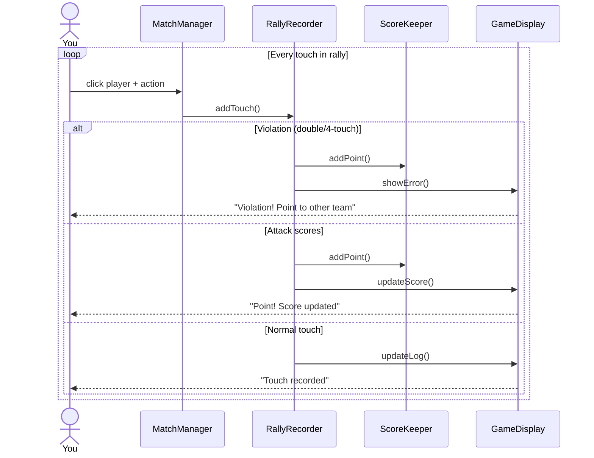

# Beach-Volleyball-Analyzer


 CLASS DIAGRAM (not final)
 ```mermaid
classDiagram
    class MatchManager {
        +run()
        +handleClick()
    }
    
    class RallyRecorder {
        +addTouch()
        +checkViolation()
    }
    
    class ScoreKeeper {
        +addPoint()
        +isSetFinished()
    }
    
    class StatTracker {
        +recordTouch()
        +recordError()
        +printReport()
    }
    
    class GameDisplay {
        +drawScoreboard()
        +drawLog()
    }
    
    class VolleyballRules {
        +isFourTouch()
        +isDoubleTouch()
        +isGameOver()
    }
    
    MatchManager *-- RallyRecorder
    MatchManager *-- ScoreKeeper
    MatchManager *-- StatTracker
    MatchManager --> GameDisplay
    RallyRecorder --> VolleyballRules
```


SEQUENCE DIAGRAM (not final)

