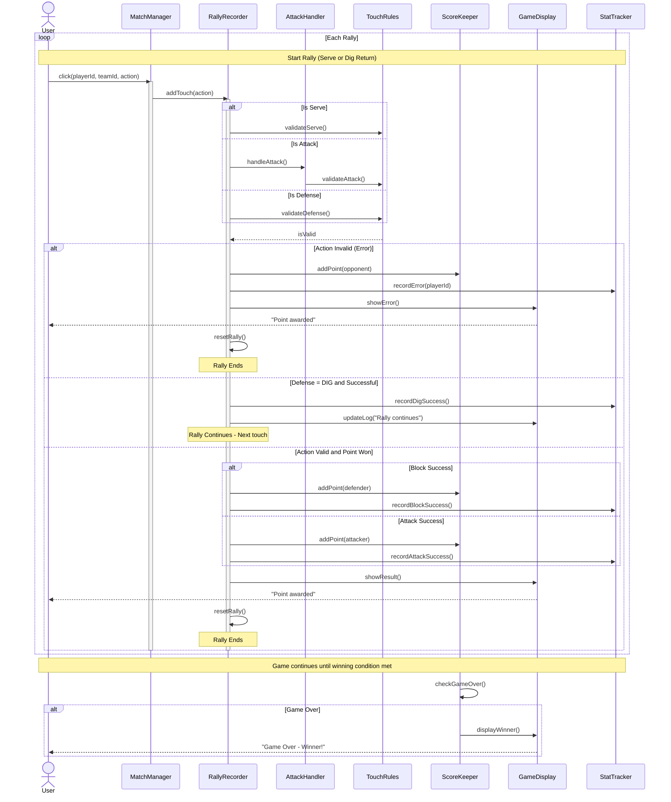

# Beach-Volleyball-Analyzer
A comprehensive C++ system for real-time beach volleyball match analysis, tracking plays, statistics, and scores for both teams and individual players.

## 🎯 Overview

The **Beach Volleyball Analyzer** is a software system designed to digitize and automate the analysis of beach volleyball matches. It provides real-time rally tracking, violation detection, statistical analysis, and score management, helping coaches, players, and analysts gain insights into game performance.

Built with object-oriented design principles, the system handles the complete match flow from serve to point scoring, including:
- Rally-by-rally play recording
- Real-time violation detection (4-touch, double touch, service errors)
- Comprehensive player and team statistics
- Win/loss margin validation following official beach volleyball rules

 CLASS DIAGRAM
 ```mermaid
classDiagram
    %% Core System
    class MatchManager {
        +run()
        +handleClick(playerId, teamId, action)
        -processRally()
    }

    class RallyRecorder {
        +addTouch(Touch)
        +checkViolation() bool
        +resetRally()
        -touches : vector~Touch~
    }

    class GameDisplay {
        +drawScoreboard()
        +drawLog()
        +showError(string)
        +updateScore()
    }

    %% Handlers
    class ServeHandler {
        +handleServe(serveTouch)
        -isValidServe(Touch) bool
    }

    class AttackHandler {
        +handleAttack(attackTouch)
        -isValidAttack(Touch) bool
    }

    %% Rules
    class ScoringRules {
        +isGameOver(score1, score2) bool
        +isSetFinished(score1, score2) bool
        +hasWinningMargin(score1, score2) bool
    }

    class TouchRules {
        +isFourTouch(vector~Touch~) bool
        +isDoubleTouch(Touch) bool
        +isValidServe(Touch) bool
        +isServiceError(Touch) bool
    }

    %% Scoring & Stats
    class ScoreKeeper {
        +addPoint(teamId)
        +getTeamScore(teamId) int
        +isSetFinished() bool
        +resetSet()
        -team1Score : int
        -team2Score : int
        -team1Sets : int
        -team2Sets : int
    }

    class StatTracker {
        +printReport()
        +reset()
    }

    class AttackStats {
        +recordAttackAttempt(playerId)
        +recordAttackSuccess(playerId)
        +recordAttackFailure(playerId)
        +printAttackStats()
    }

    class DefenseStats {
        +recordBlockAttempt(playerId)
        +recordBlockSuccess(playerId)
        +recordDigAttempt(playerId)
        +recordDigSuccess(playerId)
        +printDefenseStats()
    }

    class ErrorStats {
        +recordError(playerId)
        +printErrorStats()
    }

    %% Models
    class Touch {
        <<struct>>
        +playerId : int
        +teamId : int
        +action : string
    }

    %% Relationships
    MatchManager *-- RallyRecorder : composition
    MatchManager *-- ScoreKeeper : composition
    MatchManager *-- StatTracker : composition
    MatchManager --> GameDisplay : association
    MatchManager ..> Touch : dependency
    MatchManager --> ServeHandler : association
    MatchManager --> AttackHandler : association

    RallyRecorder --> TouchRules : association
    RallyRecorder --> ScoreKeeper : association
    RallyRecorder --> GameDisplay : association

    StatTracker *-- AttackStats : composition
    StatTracker *-- DefenseStats : composition
    StatTracker *-- ErrorStats : composition

    ScoreKeeper --> ScoringRules : association
```


SEQUENCE DIAGRAM

```mermaid
sequenceDiagram
    actor User
    participant MM as MatchManager
    participant RR as RallyRecorder
    participant AH as AttackHandler
    participant TR as TouchRules
    participant SK as ScoreKeeper
    participant GD as GameDisplay
    participant ST as StatTracker

    loop Each Rally
        Note over User,ST: Start Rally (Serve or Dig Return)
        
        User->>MM: click(playerId, teamId, action)
        activate MM
        MM->>RR: addTouch(action)
        activate RR
        
        alt Is Serve
            RR->>TR: validateServe()
        else Is Attack
            RR->>AH: handleAttack()
            AH->>TR: validateAttack()
        else Is Defense
            RR->>TR: validateDefense()
        end
        
        TR-->>RR: isValid
        
        alt Action Invalid (Error)
            RR->>SK: addPoint(opponent)
            RR->>ST: recordError(playerId)
            RR->>GD: showError()
            GD-->>User: "Point awarded"
            RR->>RR: resetRally()
            Note over RR: Rally Ends
            
        else Defense = DIG and Successful
            RR->>ST: recordDigSuccess()
            RR->>GD: updateLog("Rally continues")
            Note over RR: Rally Continues - Next touch
            
        else Action Valid and Point Won
            alt Block Success
                RR->>SK: addPoint(defender)
                RR->>ST: recordBlockSuccess()
            else Attack Success
                RR->>SK: addPoint(attacker)
                RR->>ST: recordAttackSuccess()
            end
            RR->>GD: showResult()
            GD-->>User: "Point awarded"
            RR->>RR: resetRally()
            Note over RR: Rally Ends
        end
        
        deactivate RR
        deactivate MM
    end
    
    Note over User,ST: Game continues until winning condition met
    SK->>SK: checkGameOver()
    alt Game Over
        SK->>GD: displayWinner()
        GD-->>User: "Game Over - Winner!"
    end
```
