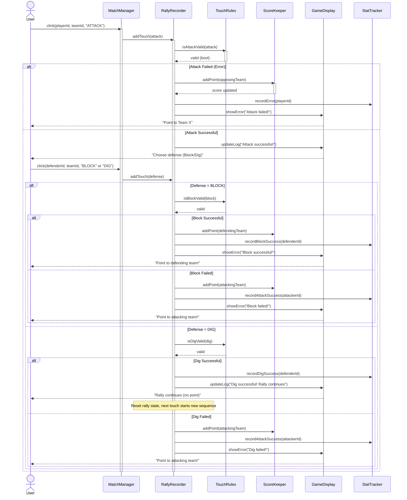

# Beach-Volleyball-Analyzer


 CLASS DIAGRAM (not final)
 ```mermaid
classDiagram
    %% Core System
    class MatchManager {
        +run()
        +handleClick(playerId, teamId, action)
        -processRally()
    }

    class RallyRecorder {
        +addTouch(Touch)
        +checkViolation() bool
        +resetRally()
        -touches : vector~Touch~
    }

    class GameDisplay {
        +drawScoreboard()
        +drawLog()
        +showError(string)
        +updateScore()
    }

    %% Rules (Refactored into two classes - SRP applied)
    class ScoringRules {
        +isGameOver(score1, score2) bool
        +isSetFinished(score1, score2) bool
        +hasWinningMargin(score1, score2) bool
    }

    class TouchRules {
        +isFourTouch(vector~Touch~) bool
        +isDoubleTouch(Touch) bool
        +isValidServe(Touch) bool
        +isServiceError(Touch) bool
    }

    %% Scoring & Stats (Refactored - ISP applied)
    class ScoreKeeper {
        +addPoint(teamId)
        +getTeamScore(teamId) int
        +isSetFinished() bool
        +resetSet()
        -team1Score : int
        -team2Score : int
        -team1Sets : int
        -team2Sets : int
    }

    class StatTracker {
        +printReport()
        +reset()
    }

    class AttackStats {
        +recordAttackAttempt(playerId)
        +recordAttackSuccess(playerId)
        +recordAttackFailure(playerId)
        +printAttackStats()
    }

    class DefenseStats {
        +recordBlockAttempt(playerId)
        +recordBlockSuccess(playerId)
        +recordDigAttempt(playerId)
        +recordDigSuccess(playerId)
        +printDefenseStats()
    }

    class ErrorStats {
        +recordError(playerId)
        +printErrorStats()
    }

    %% Models
    class Touch {
        <<struct>>
        +playerId : int
        +teamId : int
        +action : string
    }

    %% Relationships
    MatchManager *-- RallyRecorder : composition
    MatchManager *-- ScoreKeeper : composition
    MatchManager *-- StatTracker : composition
    MatchManager --> GameDisplay : association
    MatchManager ..> Touch : dependency
    
    RallyRecorder --> TouchRules : association
    RallyRecorder --> ScoreKeeper : association
    RallyRecorder --> GameDisplay : association
    
    StatTracker *-- AttackStats : composition
    StatTracker *-- DefenseStats : composition
    StatTracker *-- ErrorStats : composition
    
    ScoreKeeper --> ScoringRules : association
```


SEQUENCE DIAGRAM (not final)

```mermaid
sequenceDiagram
    actor User
    participant MatchManager
    participant RallyRecorder
    participant TouchRules
    participant ScoreKeeper
    participant GameDisplay
    participant StatTracker

    User->>MatchManager: click(playerId, teamId, "ATTACK")
    activate MatchManager
    
    MatchManager->>RallyRecorder: addTouch(attack)
    activate RallyRecorder
    
    RallyRecorder->>TouchRules: isAttackValid(attack)
    activate TouchRules
    TouchRules-->>RallyRecorder: valid (bool)
    deactivate TouchRules

    alt Attack Failed (Error)
        RallyRecorder->>ScoreKeeper: addPoint(opposingTeam)
        activate ScoreKeeper
        ScoreKeeper-->>RallyRecorder: score updated
        deactivate ScoreKeeper
        
        RallyRecorder->>StatTracker: recordError(playerId)
        RallyRecorder->>GameDisplay: showError("Attack failed!")
        GameDisplay-->>User: "Point to Team X"
        
    else Attack Successful
        RallyRecorder->>GameDisplay: updateLog("Attack successful!")
        GameDisplay-->>User: "Choose defense (Block/Dig)"
        
        User->>MatchManager: click(defenderId, teamId, "BLOCK" or "DIG")
        MatchManager->>RallyRecorder: addTouch(defense)
        
        alt Defense = BLOCK
            RallyRecorder->>TouchRules: isBlockValid(block)
            TouchRules-->>RallyRecorder: valid
            
            alt Block Successful
                RallyRecorder->>ScoreKeeper: addPoint(defendingTeam)
                RallyRecorder->>StatTracker: recordBlockSuccess(defenderId)
                RallyRecorder->>GameDisplay: showError("Block successful!")
                GameDisplay-->>User: "Point to defending team!"
            else Block Failed
                RallyRecorder->>ScoreKeeper: addPoint(attackingTeam)
                RallyRecorder->>StatTracker: recordAttackSuccess(attackerId)
                RallyRecorder->>GameDisplay: showError("Block failed!")
                GameDisplay-->>User: "Point to attacking team!"
            end
            
        else Defense = DIG
            RallyRecorder->>TouchRules: isDigValid(dig)
            TouchRules-->>RallyRecorder: valid
            
            alt Dig Successful
                RallyRecorder->>StatTracker: recordDigSuccess(defenderId)
                RallyRecorder->>GameDisplay: updateLog("Dig successful! Rally continues")
                GameDisplay-->>User: "Rally continues (no point)"
                Note over RallyRecorder: Reset rally state, next touch starts new sequence
            else Dig Failed
                RallyRecorder->>ScoreKeeper: addPoint(attackingTeam)
                RallyRecorder->>StatTracker: recordAttackSuccess(attackerId)
                RallyRecorder->>GameDisplay: showError("Dig failed!")
                GameDisplay-->>User: "Point to attacking team!"
            end
        end
    end
    
    deactivate RallyRecorder
    deactivate MatchManager
```
